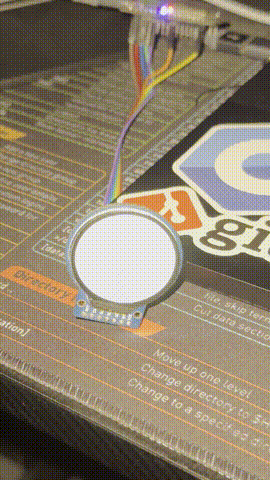
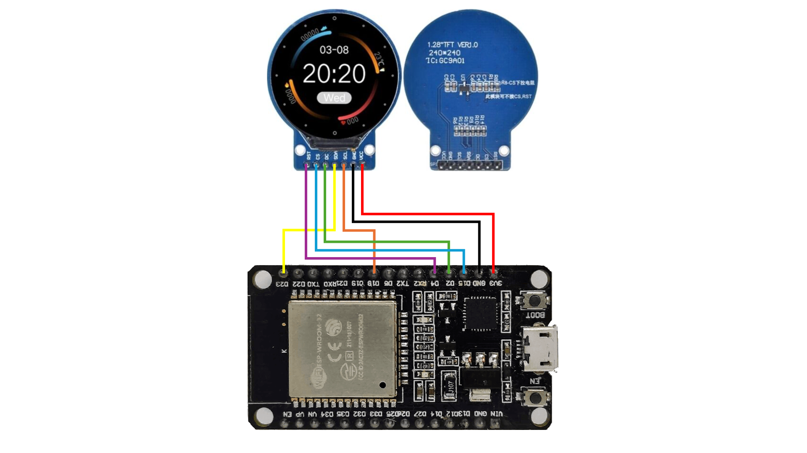

# TFT Round Display - GC9A01 with ESP32

This project demonstrates how to use a round RGB TFT display with the GC9A01 driver IC and an ESP32 microcontroller. The example includes a color test program that displays text in different colors and demonstrates the display inversion feature.



## Hardware Requirements

- ESP32 Development Board (ESP32 DOIT DevKit v1 or compatible)
- GC9A01 Round TFT Display (240x240 pixels)
- Connecting wires

## Pin Connections

Connect the TFT display to your ESP32 according to the following pin mapping:

| TFT Pin | ESP32 Pin | Function |
|---------|-----------|----------|
| MISO    | GPIO 19   | SPI Data In |
| MOSI    | GPIO 23   | SPI Data Out |
| SCLK    | GPIO 18   | SPI Clock |
| CS      | GPIO 15   | Chip Select |
| DC      | GPIO 2    | Data/Command |
| RST     | GPIO 4    | Reset |
| VCC     | 3.3V      | Power Supply |
| GND     | GND       | Ground |

### Wiring Diagram



## Software Setup

### Prerequisites

- [PlatformIO](https://platformio.org/) installed in VS Code or PlatformIO Core
- USB cable to connect ESP32 to your computer

### Installation

1. Clone or download this project
2. Open the project folder in VS Code with PlatformIO extension
3. All dependencies will be automatically downloaded (TFT_eSPI and TFT_eWidget libraries)

### Configuration

All display and pin configurations are set in [platformio.ini](platformio.ini) using build flags. The configuration includes:

- **Display Driver:** GC9A01 (round display)
- **Resolution:** 240x240 pixels
- **SPI Frequency:** 40 MHz (display), 20 MHz (read)
- **Font Support:** Multiple fonts including smooth fonts

No need to modify User_Setup.h files - everything is configured through PlatformIO build flags!

## Usage

### Building the Project

To compile the project:

```bash
platformio run
```

Or use the PlatformIO build button in VS Code.

### Uploading to ESP32

1. Connect your ESP32 to your computer via USB
2. Upload the firmware:

```bash
platformio run --target upload
```

Or use the PlatformIO upload button in VS Code.

### What the Demo Does

The example program demonstrates:

1. **Display Initialization** - Initializes the TFT with default settings
2. **Graphics** - Draws a green circle around the display edge
3. **Text Display** - Shows colored text (white, red, green, blue) on the screen
4. **Color Inversion** - Alternates between normal and inverted color modes every 5 seconds

The display will cycle through:
- Normal color mode with colored text
- Inverted color mode (swaps black/white and other colors)

### Using the TFT in Your Own Projects

The TFT_eSPI library provides many useful functions:

#### Basic Drawing Functions

```cpp
#include <TFT_eSPI.h>
TFT_eSPI tft = TFT_eSPI();

void setup() {
  tft.init();                              // Initialize display
  tft.fillScreen(TFT_BLACK);               // Fill screen with color
  tft.drawPixel(x, y, color);              // Draw a pixel
  tft.drawLine(x1, y1, x2, y2, color);     // Draw a line
  tft.drawCircle(x, y, radius, color);     // Draw a circle
  tft.fillCircle(x, y, radius, color);     // Draw a filled circle
  tft.drawRect(x, y, w, h, color);         // Draw a rectangle
  tft.fillRect(x, y, w, h, color);         // Draw a filled rectangle
}
```

#### Text Display

```cpp
tft.setCursor(x, y);                       // Set text cursor position
tft.setTextColor(color);                   // Set text color
tft.setTextColor(color, bg_color);         // Set text and background color
tft.setTextSize(size);                     // Set text size (1-7)
tft.print("Hello");                        // Print text
tft.println("World");                      // Print text with newline
```

#### Color Constants

Available built-in colors:
- `TFT_BLACK`, `TFT_WHITE`
- `TFT_RED`, `TFT_GREEN`, `TFT_BLUE`
- `TFT_CYAN`, `TFT_MAGENTA`, `TFT_YELLOW`
- `TFT_ORANGE`, `TFT_PINK`, `TFT_PURPLE`
- And more...

You can also create custom colors using RGB565 format:
```cpp
uint16_t myColor = tft.color565(r, g, b);  // r, g, b: 0-255
```

## Troubleshooting

### Colors Look Wrong

If colors appear incorrect:
1. Check if red and blue are swapped - this is a common RGB/BGR issue
2. The display may use BGR order instead of RGB
3. Try inverting the display: `tft.invertDisplay(true);`

### Display Doesn't Show Anything

1. Verify all wiring connections match the pin configuration
2. Check that your display is a GC9A01 driver (not ILI9341 or other)
3. Ensure power supply is adequate (ESP32 USB power should be sufficient)
4. Try lowering the SPI frequency in platformio.ini

### Display Flickers

- Lower the SPI_FREQUENCY in platformio.ini (try 20000000 instead of 40000000)
- Use better quality or shorter wires
- Add a small capacitor (10µF-100µF) between VCC and GND near the display

## Resources

- [TFT_eSPI Library Documentation](https://github.com/Bodmer/TFT_eSPI)
- [PlatformIO Documentation](https://docs.platformio.org/)
- [ESP32 Pinout Reference](https://randomnerdtutorials.com/esp32-pinout-reference-gpios/)

## License

This example is based on the diagnostic test from the TFT_eSPI library by Bodmer.

## Contributing

Feel free to submit issues or pull requests to improve this example!
